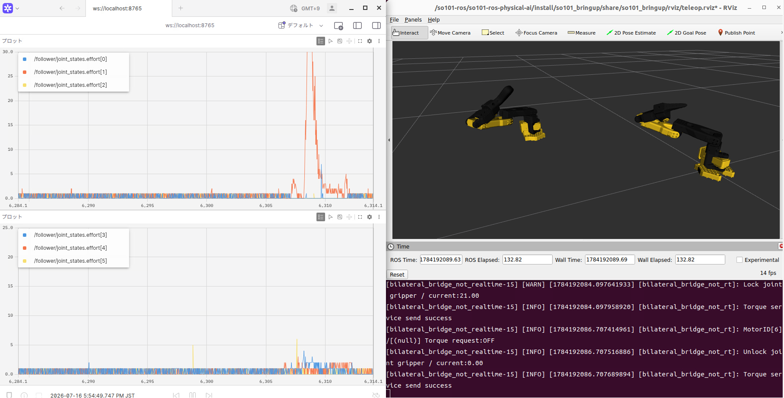
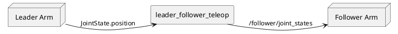
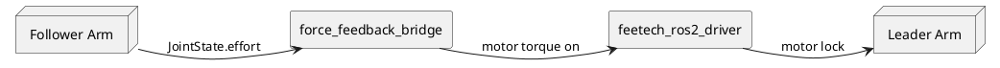

# so101_teleop_force_feedback

`so101_teleop_force_feedback` extends the original `so101_teleop` package with basic teleop_force_feedback teleoperation capabilities.  
The package monitors the follower arm motor current (effort), publishes the measured values, and provides operator feedback by locking the corresponding leader joint when the current exceeds a configurable threshold.  
This allows the operator to feel contacts, collisions, or external loads acting on the follower arm while teleoperating the robot.  

  

## Features

- teleoperation (leader to follower)
- Current (effort) feedback from follower servos
- Configurable effort thresholds per joint
- Leader joint lock when threshold is exceeded
- Additional ROS interfaces for effort acquisition

## Architecture

teleoperation



force feedback



## Added Components

Compared with the original `so101_teleop` , this package adds the following features.

### so101_teleop_force_feedback

add teleoperation node：

- `force_feedback_teleop`
- `force_feedback_bridge`

### so101_msgs

A custom service definition used to acquire servo effort values.

### feetech_ros2_driver extensions

Additional services are implemented to enable motor current values to be acquired from Feetech STS3215 servos.

## Effort Feedback Mechanism

The follower arm periodically reads motor current values from the
Feetech servos.

The follower arm periodically acquires motor current values from the Feetech servos.  
The acquisition rate is defined by `update_rate` in `so101_bringup/config/ros2_control/follower_controllers.yaml` , and the default value is 100[Hz].  

The acquired current values are published as `JointState.effort` , and monitored by the force feedback teleoperation node.  

When the effort of a joint exceeds the configured threshold: 


1. The joint is considered to be in contact with an obstacle or under a load.
2. The motor of the corresponding leader joint is locked.
3. The operator feels resistance when moving the leader arm. 

 This enables simple current-based force feedback teleoperation without requiring additional force sensors or torque sensors.  

## Quick Start

``` bash
source ~/ros2_ws/install/setup.bash
ros2 launch so101_bringup force_feedback.launch.py
```

## Configuration

### force_feedback_teleop.yaml

Main parameters for force feedback teleoperation  

Additional parameters:  

- effort topic name
- effort threshold for each joint
- lock behavior settings

| Parameter | Default Value  | Description |
| --------- | -------------- | ----------- |
| `arm_mode`        | `forward_position`                                  | Command transmission method to the Follower arm. `forward_position` or `joint_trajectory` can be selected.|
| `leader_topic`    | `/leader/teleop_force_feedback_joint_states`                    | Topic for receiving the joint states of the Leader arm |
| `jtc_topic`       | `/follower/trajectory_controller/joint_trajectory`  | Output topic in `joint_trajectory` mode. |
| `fwd_topic`       | `/follower/forward_controller/commands`             | Output topic in `forward_position` mode. |
| `publish_rate_hz` | `50.0`                                              | Command publication rate to the Follower [Hz] |
| `point_dt_s`      | `0.04`                                              | `time_from_start` value of the Trajectory Point [s]|
| `stale_timeout_s` | `0.25`                                              | Timeout period [s] after which operation stops if no data update is received from the Leader for the specified duration. |
| `lpf_alpha`       | `1.0`                                               | Low-pass filter coefficient for smoothing the position values sent to the follower arm. `1.0` disables the filter.A value of approximately `0.3` is recommended when noise or jitter is significant. |
| `arm_joints`      | `shoulder_pan`, `shoulder_lift`, `elbow_flex`, `wrist_flex`, `wrist_roll`, `gripper` | List of joints targeted for Teleoperation |

### force_feedback_bridge.yaml

Configuration parameters for the bridge node

| Parameter | Default Value | Description |
| --------- | ------------- | ----------- |
| `follower_state_topic` | `/follower/joint_states` | Topic for receiving the joint states of the follower arm. |
| `leader_state_topic` | `/leader/joint_states` | Topic for receiving the joint states of the leader arm. |
| `leader_command_topic` | `/leader/joint_commands` | Topic for sending lock/unlock commands to the leader arm. |
| `leader_state_pub_topic` | `/leader/teleop_force_feedback_joint_states` | Topic for publishing the leader joint states after applying the force feedback control logic. |
| `lock_duration` | `0.2` | Duration for which the joint is held after the lock condition is met [s] |
| `joint_names` | `shoulder_pan`, `shoulder_lift`, `elbow_flex`, `wrist_flex`, `wrist_roll`, `gripper` | List of joints monitored and controlled by the force feedback function. |
| `joint_ids` | `1`, `2`, `3`, `4`, `5`, `6` | Servo ID corresponding to each joint. |
| `current_lock_thresholds` | `20.0`, `20.0`, `30.0`, `20.0`, `20.0`, `20.0` | Current value thresholds that trigger joint locking (value * 6.5mA).  The target joint is locked when the measured current value exceeds this value. |
| `current_unlock_thresholds` | `0.5`, `0.5`, `10.0`, `0.5`, `0.5`, `0.5` | Current value thresholds that trigger unlocking (value * 6.5mA).  The target joint is unlocked when the measured current value falls below this value. |

## Limitations

The feedback mechanism in this implementation is based on the servo motor current value thresholds and the leader motor locking behavior.

Therefore：

- The feedback resolution depends on the servo current measurements
- The actual magnitude of the force is not reproduced
- Only threshold-based feedback is available

This feature is intended to provide lightweight contact detection during teleoperation and a feedback mechanism for the operator.

## Future goals

The following features are currently under development:  

- Real-time support reduces jitter, resulting in more stable control behavior. (Integration of the `ros2_realtime_support` package)
- Bilateral control (bidirectional feedback control)
