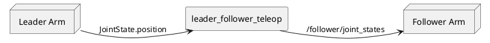
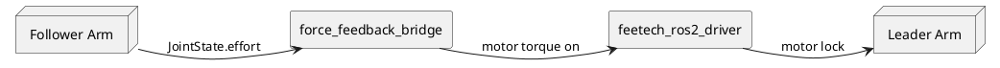

# so101_teleop_force_feedback

`so101_teleop_force_feedback` は、元の `so101_teleop` パッケージを拡張し、基本的な力覚フィードバック付きテレオペレーション機能を提供します。  
本パッケージはフォロワーアームのモータ電流値（effort）を監視し、計測した値を配信するとともに、電流値が設定可能な閾値を超えた場合に対応するリーダー関節をロックすることで操作者へフィードバックを提供します。  
これにより、ロボットを遠隔操作している際に、フォロワーアームに加わる接触、衝突、外部負荷などを操作者が感じ取ることができます。  

  

## Features

- リーダー・フォロワーによる力覚フィードバック付きテレオペレーション
- フォロワーサーボからの電流値（effort）フィードバック
- 関節ごとに設定可能な effort 閾値
- 閾値超過時のリーダー関節ロック
- effort 取得のための追加 ROS インターフェース

## Architecture

テレオペレーション経路



力覚フィードバック経路



## Added Components

元の `so101_teleop` と比較して、本パッケージでは以下の機能を追加しています。

### so101_teleop_force_feedback

新しいテレオペレーションノード：

- `force_feedback_teleop`
- `force_feedback_bridge`

### so101_msgs

サーボの effort 値を取得するために使用するカスタムサービス定義です。

### feetech_ros2_driver extensions

Feetech STS3215 サーボからモータ電流値を取得できるようにするための追加サービスを実装しています。

## Effort Feedback Mechanism

フォロワーアームは Feetech サーボからモータ電流値を周期的に取得します。  
周期は、`so101_bringup/config/ros2_control/follower_controllers.yaml` の `update_rate` で定義されており、default値は100[Hz]です。  

取得した電流値は `JointState.effort` として配信され、
双方向テレオペレーションノードによって監視されます。

関節の effort が設定された閾値を超えた場合：

1. その関節が障害物に接触した、または負荷がかかった状態とみなされます。
2. 対応するリーダー関節のモータがロックされます。
3. 操作者はリーダーアームを動かした際に抵抗を感じます。

これにより、追加の力覚センサやトルクセンサを必要とせず、
シンプルな電流値ベースの双方向テレオペレーションを実現します。

## Quick Start

``` bash
source ~/ros2_ws/install/setup.bash
ros2 launch so101_bringup teleop_force_feedback.launch.py
```

## Configuration

### force_feedback_teleop.yaml

双方向テレオペレーションの主要パラメータ

追加パラメータ：

- effort トピック名
- 関節ごとの effort 閾値
- ロック動作設定

| Parameter | Default Value  | Description |
| --------- | -------------- | ----------- |
| `arm_mode`        | `forward_position`                                  | Followerアームへのコマンド送信方式。`forward_position` または `joint_trajectory` を選択可能。 |
| `leader_topic`    | `/leader/teleop_force_feedback_joint_states`                    | Leaderアームの関節状態を受信するトピック |
| `jtc_topic`       | `/follower/trajectory_controller/joint_trajectory`  | `joint_trajectory` モード時の出力先トピック |
| `fwd_topic`       | `/follower/forward_controller/commands`             | `forward_position` モード時の出力先トピック |
| `publish_rate_hz` | `50.0`                                              | Followerへのコマンド配信周期[Hz] |
| `point_dt_s`      | `0.04`                                              | Trajectory Point の `time_from_start` 値 [s]|
| `stale_timeout_s` | `0.25`                                              | 指定時間以上 Leader からのデータ更新がない場合に停止するタイムアウト時間[s] |
| `lpf_alpha`       | `1.0`                                               | followerアームに与えるposition値を平滑化するローパスフィルタ係数。`1.0` はフィルタ無効。ノイズやジッタが大きい場合は `0.3` 程度を推奨。 |
| `arm_joints`      | `shoulder_pan`, `shoulder_lift`, `elbow_flex`, `wrist_flex`, `wrist_roll`, `gripper` | Teleoperation対象の関節一覧 |

### force_feedback_bridge.yaml

ブリッジノードの設定パラメータ

| Parameter | Default Value | Description |
| --------- | ------------- | ----------- |
| `follower_state_topic` | `/follower/joint_states` | フォロワーアームの関節状態を受信するトピック。 |
| `leader_state_topic` | `/leader/joint_states` | リーダーアームの関節状態を受信するトピック。 |
| `leader_command_topic` | `/leader/joint_commands` | リーダーアームへのロック／アンロックコマンドを送信するトピック。 |
| `leader_state_pub_topic` | `/leader/teleop_force_feedback_joint_states` | 双方向制御ロジック適用後のリーダー関節状態を配信するトピック。 |
| `lock_duration` | `0.2` | ロック条件成立後に関節を保持する時間 [s] |
| `joint_names` | `shoulder_pan`, `shoulder_lift`, `elbow_flex`, `wrist_flex`, `wrist_roll`, `gripper` | 双方向フィードバック機能で監視および制御を行う関節一覧。 |
| `joint_ids` | `1`, `2`, `3`, `4`, `5`, `6` | 各関節に対応するサーボID。 |
| `current_lock_thresholds` | `20.0`, `20.0`, `30.0`, `20.0`, `20.0`, `20.0` | 関節ロックを発生させる電流値閾値(value * 6.5mA)。計測電流値がこの値を超えた場合に対象関節をロックします。 |
| `current_unlock_thresholds` | `0.5`, `0.5`, `10.0`, `0.5`, `0.5`, `0.5` | ロック解除を行う電流値閾値(value * 6.5mA)。計測電流値がこの値を下回った場合に対象関節のロックを解除します。 |

## Limitations

本実装でのフィードバック機構はサーボモータの電流値閾値と
リーダーモータのロック動作に基づいています。

そのため：

- フィードバックの分解能はサーボの電流計測値に依存します
- 力の大きさそのものは再現されません
- 利用可能なフィードバックは閾値ベースのみです

本機能は、テレオペレーション時の軽量な接触検出および
操作者へのフィードバック機構として利用することを目的としています。

## Future goals

以下の機能を現在開発中です。  

- リアルタイム対応によりジッタを低減し、より安定した制御動作を実現します。
  （`ros2_realtime_support` パッケージの統合）
- バイラテラル制御（双方向フィードバック制御）
